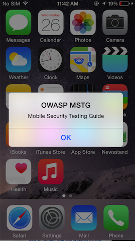
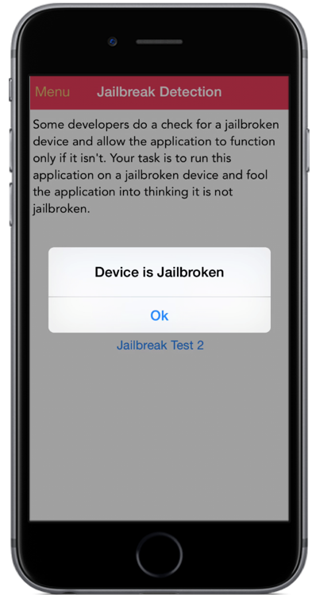
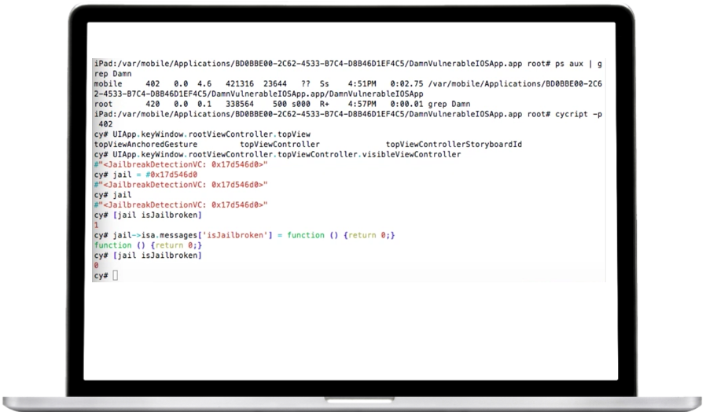
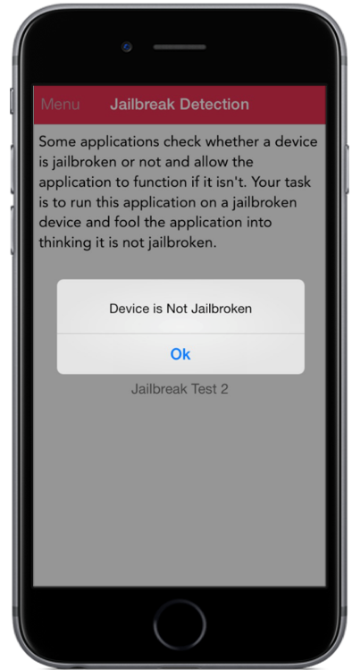

## Tampering and Reverse Engineering on iOS

<!-- ### Environment and Toolset -->

<!-- TODO [Environment Overview] -->

#### XCode and iOS SDK

XCode is an Integrated Development Environment (IDE) for macOS containing a suite of software development tools developed by Apple for developing software for macOS, iOS, watchOS and tvOS. The latest release as of the writing of this book is XCode 8 which can be [downloaded from the official Apple website](https://developer.apple.com/xcode/ide/ "Apple Xcode IDE").

The iOS SDK (Software Development Kit), formerly known as iPhone SDK, is a software development kit developed by Apple for developing native applications for iOS. The latest release as of the writing of this book is iOS 10 SDK and it can be [downloaded from the Official Apple website](https://developer.apple.com/ios/ "Apple iOS 10 SDK") as well.

#### Utilities

- [Class-dump by Steve Nygard](http://stevenygard.com/projects/class-dump/) is a command-line utility for examining the Objective-C runtime information stored in Mach-O files. It generates declarations for the classes, categories and protocols.

- [Class-dump-z](https://code.google.com/archive/p/networkpx/wikis/class_dump_z.wiki) s re-write of class-dump from scratch using C++, avoiding using dynamic calls. Removing these unnecessary calls makes class-dump-z near 10 times faster than the precedences.

- [Class-dump-dyld by Elias Limneos](https://github.com/limneos/classdump-dyld/) allows dumping and retrieving symbols directly from the shared cache, eliminating the need to extract the files first. It can generate header files from app binaries, libraries, frameworks, bundles or the whole dyld_shared_cache. Is is also possible to Mass-dump the whole dyld_shared_cache or directories recursively.

- [MachoOView]( https://sourceforge.net/projects/machoview/) is a useful visual Mach-O file browser that also allows for in-file editing of ARM binaries.

- otool is a tool for  displays  specified  parts	of object files or libraries. It understands both Mach-O (Mach object) files and universal file formats.  

#### Reversing Frameworks

Radare2 is a complete framework for reverse-engineering and analyzing. It is built around the Capstone disassembler, Keystone assembler, and Unicorn CPU emulation engine. Radare2 has support for iOS binaries and many useful iOS-specific features, such as a native Objective-C parser, and an iOS debugger.

#### Commercial Disassemblers

IDA Pro can deal with iOS binaries and has a built-in iOS debugger. IDA is widely seen as the gold standard for GUI-based, interactive static analysis, but it isn't cheap. For the more budget-minded reverse engineer, Hopper offers similar static analysis features.

### Reverse Engineering iOS Apps

iOS reverse engineering is a mixed bag. On the one hand, apps programmed in Objective-C and Swift can be disassembled nicely. In Objective-C, object methods are called through dynamic function pointers called "selectors", which are resolved by name during runtime. The advantage of this is that these names need to stay intact in the final binary, making the disassembly more readable. Unfortunately, this also has the effect that no direct cross-references between methods are available in the disassembler, and constructing a flow graph is challenging.

In this guide, we'll give an introduction on static and dynamic analysis and instrumentation. Throughout this chapter, we'll be referring to the OWASP UnCrackable Apps for iOS, so download them from MSTG repository if you're planning to follow the examples.

#### Static Analysis

##### Recovering an IPA File From an Installed App

###### From Jailbroken Devices

You can use [Saurik's IPA Installer](http://cydia.saurik.com/package/com.autopear.installipa/ "IPA Installer Console") to recover IPAs from apps installed on the device. To do this, install IPA installer console via Cydia. Then, ssh into the device and look up the bundle id of the target app. For example:

~~~
iPhone:~ root# ipainstaller -l
com.apple.Pages
com.example.targetapp
com.google.ios.youtube
com.spotify.client
~~~

Generate the IPA file for using the following command:

~~~
iPhone:~ root# ipainstaller -b com.example.targetapp -o /tmp/example.ipa
~~~

###### From non-Jailbroken Devices

If the app is available on itunes, you are able to recover the ipa on MacOS with the following simple steps:

- Download the app in itunes
- Go to your itunes Apps Library
- Right-click on the app and select show in finder

<!-- TODO [Further develop section on Static Analysis of an iOS app from non-jailbroken devices without source code] -->

#### Dumping Decrypted Executables

On top of code signing, apps distributed via the app store are also protected using Apple's FairPlay DRM system. This system uses asymmetric cryptography to ensure that any app (including free apps) obtained from the app store only executes on the particular device it is approved to run on. The decryption key is unique to the device and burned into the processor. As of now, the only possible way to obtain the decrypted code from a FairPlay-decrypted app is dumping it from memory while the app is running. On a jailbroken device, this can be done with Clutch tool that is included in standard Cydia repositories [2]. Use clutch in interactive mode to get a list of installed apps, decrypt them and pack to IPA file:

~~~
# Clutch -i
~~~

**NOTE:** Only applications distributed with AppStore are protected with FairPlay DRM. If you obtained your application compiled and exported directly from XCode, you don't need to decrypt it. The easiest way is to load the application into Hopper and check if it's being correctly disassembled. You can also check it with otool:

~~~
# otool -l yourbinary | grep -A 4 LC_ENCRYPTION_INFO
~~~

If the output contains cryptoff, cryptsize and cryptid fields, then the binary is encrypted. If the output of this comand is empty, it means that binary is not encrypted. **Remember** to use otool on binary, not on the IPA file.

#### Getting Basic Information with Class-dump and Hopper Disassembler

Class-dump tool can be used to get information about methods in the application. Example below uses [Damn Vulnerable iOS Application]( http://damnvulnerableiosapp.com/). As our binary is so-called fat binary, which means that it can be executed on 32 and 64 bit platforms:

```
$ unzip DamnVulnerableiOSApp.ipa

$ cd Payload/DamnVulnerableIOSApp.app

$ otool -hv DamnVulnerableIOSApp

DamnVulnerableIOSApp (architecture armv7):
Mach header
      magic cputype cpusubtype  caps    filetype ncmds sizeofcmds      flags
   MH_MAGIC     ARM         V7  0x00     EXECUTE    38       4292   NOUNDEFS DYLDLINK TWOLEVEL WEAK_DEFINES BINDS_TO_WEAK PIE

DamnVulnerableIOSApp (architecture arm64):
Mach header
      magic cputype cpusubtype  caps    filetype ncmds sizeofcmds      flags
MH_MAGIC_64   ARM64        ALL  0x00     EXECUTE    38       4856   NOUNDEFS DYLDLINK TWOLEVEL WEAK_DEFINES BINDS_TO_WEAK PIE

```

Note architecture `armv7` which is 32 bit and `arm64`. This design permits to deploy the same application on all devices.
In order to analyze the application with class-dump we must create so-called thin binary, which contains only one architecture:

```
iOS8-jailbreak:~ root# lipo -thin armv7 DamnVulnerableIOSApp -output DVIA32
```

And then we can proceed to performing class-dump:

```
iOS8-jailbreak:~ root# class-dump DVIA32

@interface FlurryUtil : ./DVIA/DVIA/DamnVulnerableIOSApp/DamnVulnerableIOSApp/YapDatabase/Extensions/Views/Internal/
{
}
+ (BOOL)appIsCracked;
+ (BOOL)deviceIsJailbroken;
```

Note the plus sign, which means that this is a class method returning BOOL type.
A minus sign would mean that this is an instance method. Please refer to further sections to understand the practical difference between both.

Alternatively, you can easily decompile the application with [Hopper Disassembler](https://www.hopperapp.com/). All these steps will be performed automatically and you will be able to see disassembled binary and class information.

Your main focus while performing static analysis would be:
* Identifying and understanding functions responsible for jailbreak detection and certificate pinning
  * For jailbreak detection, look for methods or classes containing words like `jailbreak`, `jailbroken`, `cracked`, etc. Please note that sometimes, the name of function performing jailbreak detection will be 'obfuscated' to slow down the analysis. Your best bet is to look for jailbreak detection mechanisms discussed in further section (cf. Dynamic Analysis - Jailbreak Detection)
  * For certificate pinning, look for keywords like `pinning`, `X509` or for native method calls like `NSURLSession`, `CFStream`, `AFNetworking`
* Understanding application logic and possible ways to bypass it
* Any hardcoded credentials, certificates
* Any methods that are used for obfuscation and in consequence may reveal sensitive information


Other commands:

Listing shared libraries:


```bash
$ otool -L <binary>
```

#### Debugging

<!-- TODO [iOS Debugging Overview] -->

Debugging on iOS is generally implemented via Mach IPC. To "attach" to a target process, the debugger process calls the <code>task_for_pid()</code> function with the process id of the target process to and receives a Mach port. The debugger then registers as a receiver of exception messages and starts handling any exceptions that occur in the debuggee. Mach IPC calls are used to perform actions such as suspending the target process and reading/writing register states and virtual memory.

Even though the XNU kernel implements the <code>ptrace()</code> system call as well, some of its functionality has been removed, including the capability to read and write register states and memory contents. Even so, <code>ptrace()</code> is used in limited ways by standard debuggers such as <code>lldb</code> and <code>gdb</code>. Some debuggers, including Radare2's iOS debugger, don't invoke <code>ptrace</code> at all.

##### Using lldb

iOS ships with a console app, debugserver, that allows for remote debugging using gdb or lldb. By default however, debugserver cannot be used to attach to arbitrary processes (it is usually only used for debugging self-developed apps deployed with XCode). To enable debugging of third-part apps, the task_for_pid entitlement must be added to the debugserver executable. An easy way to do this is adding the entitlement to the [debugserver binary shipped with XCode](http://iphonedevwiki.net/index.php/Debugserver "Debug Server on the iPhone Dev Wiki").

To obtain the executable mount the following DMG image:

~~~
/Applications/Xcode.app/Contents/Developer/Platforms/iPhoneOS.platform/ DeviceSupport/<target-iOS-version//DeveloperDiskImage.dmg
~~~

You’ll find the debugserver executable in the /usr/bin/ directory on the mounted volume - copy it to a temporary directory. Then, create a file called entitlements.plist with the following content:

~~~
<?xml version="1.0" encoding="UTF-8"?>
<!DOCTYPE plist PUBLIC "-//Apple//DTD PLIST 1.0//EN" "http://www.apple.com/DTDs/ PropertyList-1.0.dtd">
<plist version="1.0">
<dict>
	<key>com.apple.springboard.debugapplications</key>
	<true/>
	<key>run-unsigned-code</key>
	<true/>
	<key>get-task-allow</key>
	<true/>
	<key>task_for_pid-allow</key>
	<true/>
</dict>
</plist>
~~~

And apply the entitlement with codesign:

~~~
codesign -s - --entitlements entitlements.plist -f debugserver
~~~

Copy the modified binary to any directory on the test device (note: The following examples use usbmuxd to forward a local port through USB).

~~~
$ ./tcprelay.py -t 22:2222
$ scp -P2222 debugserver root@localhost:/tmp/
~~~

You can now attach debugserver to any process running on the device.

~~~
VP-iPhone-18:/tmp root# ./debugserver *:1234 -a 2670
debugserver-@(#)PROGRAM:debugserver  PROJECT:debugserver-320.2.89
 for armv7.
Attaching to process 2670...
~~~

<!-- TODO [Solving UnCrackable App with lldb] -->

##### Using Radare2

<!-- TODO [Write Radare2 tutorial] -->

### Tampering and Instrumentation

#### Hooking with MobileSubstrate

#### Cycript and Cynject

Cydia Substrate (formerly called MobileSubstrate) is the de-facto standard framework for developing run-time patches (“Cydia Substrate extensions”) on iOS. It comes with Cynject, a tool that provides code injection support for C. Cycript is a scripting language developed by Jay Freeman (saurik). Cycript injects a JavaScriptCore VM into the running process. Users can then manipulate the process using a hybrid of Objective-C++ and JavaScript syntax through the Cycript interactive console. It is also possible to access and instantiate Objective-C classes inside a running process. Some examples for the use of Cycript are listed in the iOS chapter.

First the SDK need to be downloaded, unpacked and installed.
```bash
$ wget https://cydia.saurik.com/api/latest/3 -O cycript.zip && unzip cycript.zip
#on iphone
$ sudo cp -a Cycript.lib/*.dylib /usr/lib
$ sudo cp -a Cycript.lib/cycript-apl /usr/bin/cycript
```
To spawn the interactive cycript shell, you can run “./cyript” or just “cycript” if cycript is on your path.
```bash
$ cycyript
cy#
```
To inject into a running process, we need to first find out the process ID (PID). We can run "cycript -p" with the PID to inject cycript into the process. To illustrate we will inject into springboard.

```bash
$ ps -ef | grep SpringBoard
501 78 1 0 0:00.00 ?? 0:10.57 /System/Library/CoreServices/SpringBoard.app/SpringBoard
$ ./cycript -p 78
cy#
```

We have injected cycript into SpringBoard, lets try to trigger an alert message on SpringBoard with cycript. 		

```bash
cy# alertView = [[UIAlertView alloc] initWithTitle:@"OWASP MSTG" message:@"Mobile Security Testing Guide"  delegate:nil cancelButtonitle:@"OK" otherButtonTitles:nil]
#"<UIAlertView: 0x1645c550; frame = (0 0; 0 0); layer = <CALayer: 0x164df160>>"
cy# [alertView show]
cy# [alertView release]
```


Discover the document directory with cycript:
```bash
cy# [[NSFileManager defaultManager] URLsForDirectory:NSDocumentDirectory inDomains:NSUserDomainMask][0]
#"file:///var/mobile/Containers/Data/Application/A8AE15EE-DC8B-4F1C-91A5-1FED35212DF/Documents/"
```

Get the delegate class for the application using the command below:
```bash
cy# [UIApplication sharedApplication].delegate
```
The command [[UIApp keyWindow] recursiveDescription].toString() returns the view hierarchy of keyWindow. The description of every subview and sub-subview of keyWindow will be shown and the indentation space reflects the relationships of each views. For an example UILabel, UITextField and UIButton are subviews of UIView.

```
cy# [[UIApp keyWindow] recursiveDescription].toString()
`<UIWindow: 0x16e82190; frame = (0 0; 320 568); gestureRecognizers = <NSArray: 0x16e80ac0>; layer = <UIWindowLayer: 0x16e63ce0>>
   | <UIView: 0x16e935f0; frame = (0 0; 320 568); autoresize = W+H; layer = <CALayer: 0x16e93680>>
   |    | <UILabel: 0x16e8f840; frame = (0 40; 82 20.5); text = 'i am groot!'; hidden = YES; opaque = NO; autoresize = RM+BM; userInteractionEnabled = NO; layer = <_UILabelLayer: 0x16e8f920>>
   |    | <UILabel: 0x16e8e030; frame = (0 110.5; 320 20.5); text = 'A Secret Is Found In The ...'; opaque = NO; autoresize = RM+BM; userInteractionEnabled = NO; layer = <_UILabelLayer: 0x16e8e290>>
   |    | <UITextField: 0x16e8fbd0; frame = (8 141; 304 30); text = ''; clipsToBounds = YES; opaque = NO; autoresize = RM+BM; gestureRecognizers = <NSArray: 0x16e94550>; layer = <CALayer: 0x16e8fea0>>
   |    |    | <_UITextFieldRoundedRectBackgroundViewNeue: 0x16e92770; frame = (0 0; 304 30); opaque = NO; autoresize = W+H; userInteractionEnabled = NO; layer = <CALayer: 0x16e92990>>
   |    | <UIButton: 0x16d901e0; frame = (8 191; 304 30); opaque = NO; autoresize = RM+BM; layer = <CALayer: 0x16d90490>>
   |    |    | <UIButtonLabel: 0x16e72b70; frame = (133 6; 38 18); text = 'Verify'; opaque = NO; userInteractionEnabled = NO; layer = <_UILabelLayer: 0x16e974b0>>
   |    | <_UILayoutGuide: 0x16d92a00; frame = (0 0; 0 20); hidden = YES; layer = <CALayer: 0x16e936b0>>
   |    | <_UILayoutGuide: 0x16d92c10; frame = (0 568; 0 0); hidden = YES; layer = <CALayer: 0x16d92cb0>>`
```

<!-- TODO Obtain references to existing objects -->
<!-- TODO Instantiate objects from classes -->

##### Hooking native functions & objective-C methods
* Install the application to be hooked.
* Run the application and make it sure the app is in foreground (should not be in paused state).
* Find the PID of the app using the command: `ps ax | grep App`.
* Hook into the running process by using the command: `cycript -p PID`.
* Cycript interpreter will be provided, on successful hooking. You can get the instance of the application by using the Objective-C syntax `[UIApplication sharedApplication]`.

```
cy# [UIApplication sharedApplication]
cy# var a = [UIApplication sharedApplication]
```
* To find the delegate class of this application:
```
cy# a.delegate
```
* Let’s print out the methods for AppDelegate class: 
```
cy# printMethods (“AppDelegate”)
```

##### Bypassing the Jailbreak Detection using Cycript
Use of cycript to overwrite the method implementation to bypass the `JailbreakDetection`.








Cycript tricks:

http://iphonedevwiki.net/index.php/Cycript_Tricks

<!-- TODO [Develop section on Frida] -->
